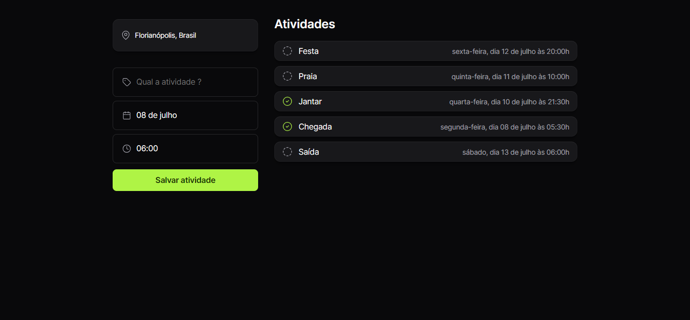

# Projeto de Planner Simples

## Visão Geral

Este projeto é uma aplicação simples de planner desenvolvida durante a NLW Journey da RocketSeat. Permite aos usuários adicionar novas tarefas, selecionando sua data e hora dentro de um intervalo pré-definido, e marcá-las como concluídas.

## Funcionalidades

- Interface amigável.
- Design responsivo utilizando HTML e CSS.
- Integração simples de JavaScript para funcionalidades dinâmicas.

## Tecnologias Utilizadas

- HTML: Estrutura do conteúdo.
- CSS: Estilização e responsividade.
- JavaScript: Interatividade e manipulação de dados.